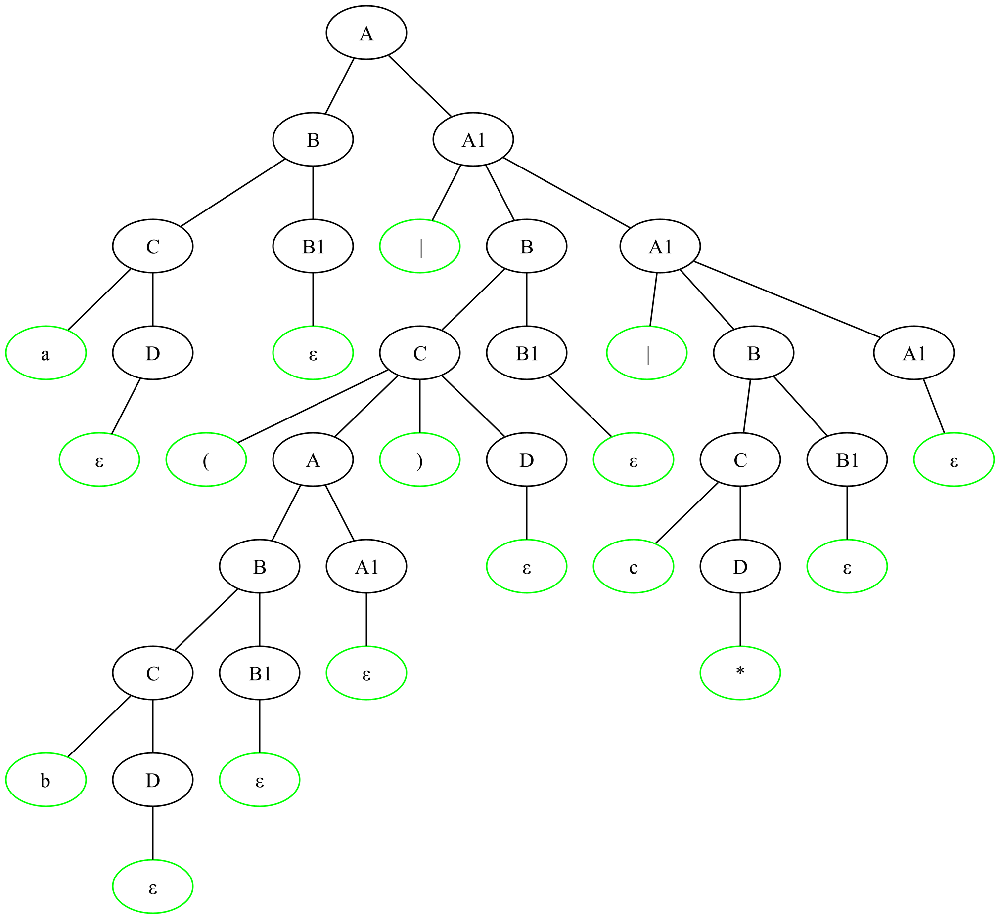

# Грамматика языка регулярных выражений
$$
\begin {align*}
A & \rightarrow BA_1 \\
A & \rightarrow \varepsilon \\
A_1 & \rightarrow | B A_1 \\
A_1 & \rightarrow \varepsilon \\
B & \rightarrow C B_1 \\
B & \rightarrow \varepsilon \\
B_1 & \rightarrow C B_1 \\
B_1 & \rightarrow \varepsilon\\
C & \rightarrow (A)D \\
C & \rightarrow char D \\
D & \rightarrow * \\
D & \rightarrow \varepsilon
\end {align*}
$$
Модификация: 
$$
\begin {align*}
D & \rightarrow \{N\} \\
N & \rightarrow number \\
N & \rightarrow \varepsilon
\end {align*}
$$


Создана по аналогии с грамматикой арифметических выражений, тоже представлен приоритет операций (или, и, символ Клини).

Построим таблицу `FIRST` и `FOLLOW`: 

|Нетерминал|FIRST|FOLLOW|
|-|-|-|
|$A$|$\varepsilon, \, char ,\,(,\|$|$\$, )$|
|$A_1$|$\varepsilon, \|$|$\$, )$|
|$B$|$\varepsilon, char,($|$\|, \$, )$|
|$B_1$|$\varepsilon, char,($|$\|, (, \,char\,, )$|
|$C$|$char,($|$\|, (, \, char\,,)$|
|$D$|$*,\varepsilon$|$\|, (, \, char\,,)$|

Модификация:
|Нетерминал|FIRST|FOLLOW|
|-|-|-|
|$D$|$*,\varepsilon, \{$|$\|, (, \, char\,,), \}, number$|
|$D$|$number,\varepsilon$|$\|,  \}, number$|
#### Тесты:
|Тест|Описание|
|-|-|
|''|Пустая строка|
|'     '| Пробелы|
|\|, ()|Одиночные операторы|
|abc|Последовательность букв|
|((a*)* \|(b*)* \|(c*)*)*|Всё и сразу|

#### Пример дерева разбора:

```
a|(b)|c*
```
